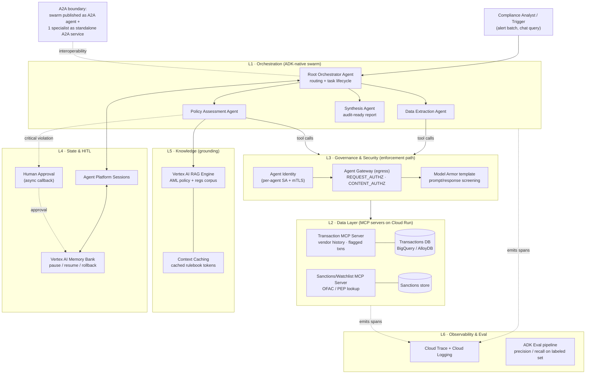
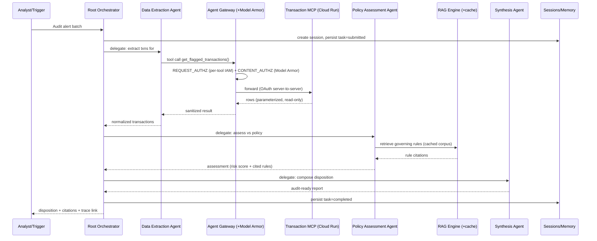
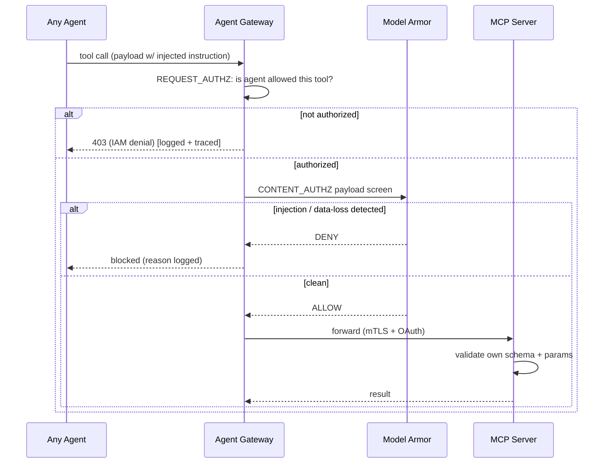

# ReguGuard — Solution Architecture Document (SAD) & Phased Delivery Plan
### An Agentic AML/Sanctions-Compliance Swarm on the Gemini Enterprise Agent Platform
*Stream 2 — High-Code / Custom Agents & MCP · Version 1.0*

---

## 0. How to read this document
This SAD is written to be executed under hackathon time pressure by a team of 2–3 Solution Architects. It is deliberately organized so that **each phase in §10 is independently testable and deployable** — you always have a running system to demo, and later layers bolt on without breaking earlier ones. Sections §1–§9 define *what* you are building; §10–§13 define *how and in what order*.

---

## 1. Validation Summary — Keep / Fix / Cut

**Overall verdict:** The ReguGuard concept is architecturally sound and unusually well-mapped to the Stream 2 rubric. It should be built — with the scope discipline below.

| Decision | Item | Rationale |
|---|---|---|
| **KEEP** | Multi-agent swarm (L1), MCP data layer (L2), Governance/security (L3), State + HITL (L4), Context caching (L5), Observability + eval (L6) | Each maps directly to a weighted rubric criterion. This is the winning core. |
| **FIX** | Full A2A distribution of every agent | Use ADK-native orchestration for the core swarm; demonstrate A2A at one boundary only (see §4.1). Lower operational risk, same score. |
| **FIX** | "Gemini 3.5 Flash" | Not a valid model name. Verify the exact Flash SKU available in your provisioned project before citing it anywhere. |
| **FIX** | Model Armor as sole tool-poisoning defense | Split the narrative: Model Armor screens prompt/response payloads; the MCP server validates its own schema/params. Claim defense-in-depth, not a single control. |
| **CUT (from build)** | Layer 7 — LoRA/PEFT distillation to Gemma/Flash | Zero rubric points in-window; high effort. **Keep it as a "Future Value" roadmap slide** — it is an excellent long-term-ROI narrative, just not a build item. |

**The single biggest risk is over-scoping.** The phased plan in §10 exists to guarantee a working demo even if only Phases 1–2, 4 and 6 complete.

---

## 2. Refined Use Case & Value Proposition

**Generic "financial compliance" is too broad to win the 25% Use-Case-Discovery weight.** Anchor to a specific, quantifiable, EPAM-aligned scenario:

> **ReguGuard: Autonomous AML Alert Triage & Sanctions-Screening Analyst.**
> When a transaction-monitoring system raises an alert (or a batch of daily alerts), ReguGuard's agent swarm pulls the transaction and counterparty data, cross-references it against the institution's AML policy, OFAC/sanctions lists, and internal risk rules, and produces an **audit-ready disposition** — *escalate / clear / request-info* — with full citations to the governing rule. Critical or high-risk dispositions are **paused for human sign-off** before completion.

**Why this scenario:**
- **Board-level, quantifiable pain.** Industry AML alert false-positive rates commonly exceed 90–95%; each alert costs an analyst meaningful investigation time. Even a modest reduction in analyst hours per alert is a hard-dollar ROI story you can put a number on in the pitch.
- **EPAM org-fit.** Mirrors EPAM's shipped *Agentic KYC* Gemini Enterprise agent and its largest, fastest-growing vertical (Financial Services). This is a marketplace-ready accelerator, not a toy.
- **Regulatory specificity = credibility.** Naming concrete frameworks (BSA/AML, OFAC sanctions, FATF risk factors) demonstrates real domain context — directly serving the "acts as a true domain expert" top score on Agentic Reliability.

**ROI framing for the pitch (fill with your own assumptions):** `annual_alerts × analyst_minutes_saved_per_alert × loaded_analyst_cost` + avoided regulatory-fine risk from missed true positives. Present as a one-line model, not a claim.

---

## 3. Architecture Principles

1. **Vertical slice first.** A single end-to-end path (one agent → one MCP tool → one grounded answer) must run before any horizontal expansion.
2. **Decoupled by default.** Agents communicate through advertised capabilities; data is reached only through MCP tools — never hardcoded DB wrappers. Swapping a legacy source means standing up a new MCP server.
3. **Governed everywhere, uniformly.** No agent talks to a tool except through the enforcement path (identity → gateway → policy → Model Armor). Security is a property of the platform, not each agent.
4. **Stateful and interruptible.** Long-running audits can pause for humans and resume deterministically.
5. **Everything is traced and evaluable.** No "invisible toolchains" — every hop emits a trace; reliability is proven with numbers, not adjectives.

---

## 4. High-Level Architecture (HLD)



**Reading the HLD.** The user (or an automated alert trigger) hits the **Root Orchestrator**, which routes to specialist agents. Any agent that needs data does *not* call a database directly — it issues an MCP tool call that is forced through the **governance enforcement path** (identity → Agent Gateway egress → Model Armor) before reaching a **Cloud Run MCP server**. The **Policy Assessment Agent** additionally grounds against the RAG corpus (with context caching for the dense rulebook). **Sessions + Memory Bank** hold audit state and enable the human-in-the-loop pause/resume. Everything emits traces to **Cloud Trace**, and the **ADK eval pipeline** scores the swarm offline.

---

## 4.1 Orchestration Design Decision — ADK-native + selective A2A

> **This is the key refinement over the original blueprint.** Running all five agents as independent A2A services multiplies Cloud Run services, cold-starts, network hops and failure modes — buying little reliability for a lot of operational risk in a hackathon.

**Do this instead:**
- **Core swarm = ADK-native orchestration.** The Root Orchestrator holds Data-Extraction, Policy-Assessment and Synthesis as `sub_agents` (or wraps them with `AgentTool`). In-process, robust, easy to trace, localized retry per sub-agent.
- **Demonstrate A2A at exactly one boundary,** so you still score the "platform extensibility / interoperability" points:
  - Publish the **entire ReguGuard swarm as an A2A-compliant agent** (expose an Agent Card) so it can be consumed by any external orchestrator, *and*
  - Run **one specialist (e.g., the Sanctions-Screening agent) as a standalone A2A service** to prove cross-service delegation over JSON-RPC 2.0 / HTTPS with task-lifecycle states (`submitted → working → completed`).

This gives evaluators the full A2A narrative (Agent Cards, capability-based delegation, lifecycle tracking) while keeping the critical path reliable.

---

## 5. Component Design (Layer by Layer)

### L1 · Orchestration Layer
- **Root Orchestrator Agent** — primary interface; interprets the request, selects the delegation path from downstream capabilities, tracks task lifecycle, aggregates results. Owns retry policy. Does **not** perform analysis itself.
- **Data Extraction Agent** — structured retrieval specialist; calls Transaction/Sanctions MCP tools; normalizes results.
- **Policy Assessment Agent** — the reasoning core; grounds transaction facts against the RAG policy corpus and encoded risk rules; emits a rule-cited assessment.
- **Synthesis Agent** — compiles findings into a structured, audit-ready disposition (schema in §8).
- **Error isolation** — because sub-agents are decoupled, a timeout in Data Extraction triggers *localized* retry, not a full re-run of the deliberation loop.

### L2 · Data Layer (MCP)
- **Transaction MCP Server** (Cloud Run) — compliance-shaped tools: `get_vendor_history(vendor_id)`, `list_flagged_transactions(start, end, threshold)`, `get_transaction(txn_id)`. Parameterized, read-only, least-privilege queries — no raw SQL surface exposed to the model (this is also a **token-optimization** control: pre-vetted tools return compact results).
- **Sanctions/Watchlist MCP Server** (Cloud Run) — `screen_entity(name, dob, country)` against OFAC/PEP data.
- **Auth** — every MCP call validated with **server-to-server OAuth**; only agents presenting a valid token invoke tools. Each server validates its own tool schema and parameters (first half of the anti-tool-poisoning defense).
- **Extensibility proof** — a new legacy source = a new MCP server, zero agent code changes. State this explicitly in the pitch.
- **Build option** — you may use Google's open-source **MCP Toolbox for Databases** (declarative `tools.yaml`, IAM auth, parameterized queries, OpenTelemetry) to stand these up fast, or hand-roll with FastMCP for full control. Toolbox is the faster path and still demonstrates governed access.

### L3 · Governance & Security Layer
- **Agent Identity** — unique, trackable persona (service account) per agent; end-to-end mutual TLS between components.
- **Agent Gateway (egress)** — *all* agent→tool traffic is forced through the gateway. `REQUEST_AUTHZ` enforces per-tool IAM (is this agent allowed to call this tool?); `CONTENT_AUTHZ` invokes Model Armor.
- **Model Armor template** — screens tool-call and response payloads for prompt injection, sensitive-data leakage, and harmful content; returns a denial before the model processes a malicious instruction (second half of the anti-poisoning defense).
- **Perimeter** — Cloud Armor (WAF/DDoS) + Identity-Aware Proxy on any human-facing ingress.

### L4 · State & Memory Layer
- **Agent Platform Sessions** — conversational/operational state per audit.
- **Vertex AI Memory Bank** — durable memory; stores exact session state on pause; supports structured history for rollback if an audit path proves wrong.
- **HITL control** — on a *critical* violation the swarm **pauses**, persists state, fires an async alert to a compliance officer, and resumes only after approval is recorded. This is the standout Reliability demonstration.

### L5 · Knowledge & Context Layer
- **Vertex AI RAG Engine** — indexes the AML policy library, regulatory frameworks, and internal risk rules; the Policy Assessment Agent retrieves grounded citations (kills hallucination on rule text).
- **Context Caching** — the dense, static rulebook is cached as precomputed input tokens and reused across audits — cutting latency and token cost versus re-injecting the corpus per transaction. This is a concrete, measurable **token-optimization** win to show on the dashboard.

### L6 · Observability & Evaluation Layer
- **Cloud Trace + Cloud Logging** — every A2A/MCP hop emits spans; dashboard shows token usage, tool-call latency, and the exact delegation path per audit.
- **ADK Eval pipeline** — a labeled dataset of synthetic transactions with *deliberately planted* violations; automated scoring of the swarm on correct-flag rate and false-positive rate. The resulting precision/recall matrix is your "undeniable proof of reliability" pitch slide.

### L7 · (Roadmap only — do not build) Distillation & Fine-Tuning
Capture successful reasoning traces; later apply PEFT/LoRA to distill routine, high-volume checks into a smaller Flash/Gemma "student" model for cost and latency reduction. **Present as future value; keep zero build tasks in-window.**

---

## 6. Low-Level Design (Key Flows)

### 6.1 End-to-end audit — A2A + MCP interaction



### 6.2 Human-in-the-loop pause / resume on critical violation

```mermaid
sequenceDiagram
    participant P as Policy Assessment Agent
    participant O as Root Orchestrator
    participant SE as Sessions/Memory Bank
    participant H as Compliance Officer

    P->>O: CRITICAL violation detected (risk >= threshold)
    O->>SE: snapshot exact state, task=paused
    O->>H: async alert (link to context)
    Note over O,H: swarm is idle; no tokens burned
    H-->>O: approve / reject (recorded)
    alt approved
        O->>SE: restore state, task=working
        O->>O: resume synthesis
    else rejected
        O->>SE: restore state, branch=alternate path
    end
```

### 6.3 Security enforcement — deny path (the "impenetrable defense" demo)


> **Demo tip:** scripting one *authorized-but-poisoned* call that Model Armor blocks, and one *unauthorized-tool* call that IAM blocks, gives you two visible, judge-friendly denials that prove the 30%-weighted security story.

---

## 7. Technology Component Design & Rubric Traceability

| Layer | Component | Google Cloud service / tech | Purpose | Rubric criterion served |
|---|---|---|---|---|
| L1 | Agent framework | **ADK** (Python) + `sub_agents`/`AgentTool` | Multi-agent orchestration, localized retry | Architecture (15%), Reliability (15%) |
| L1 | Runtime | **Vertex AI Agent Engine** (managed) or Cloud Run | Deploy swarm | Architecture (15%), Security (30%) |
| L1 | Interop | **A2A protocol** (Agent Cards, JSON-RPC 2.0) at 1 boundary | Extensibility/interoperability | Architecture (15%) |
| L2 | Data tools | **MCP servers on Cloud Run** (FastMCP or MCP Toolbox) | Governed, decoupled data access | Architecture (15%), Security (30%) |
| L2 | Data stores | **BigQuery / AlloyDB / Cloud SQL** | Transactions + sanctions data | Use-Case (25%) |
| L2 | Tool auth | **Server-to-server OAuth**, parameterized read-only queries | AuthZ + token optimization | Security (30%) |
| L3 | Identity | **Agent Identity** (per-agent SA, mTLS) | Cryptographic per-agent identity | Security (30%) |
| L3 | Enforcement | **Agent Gateway** (REQUEST_AUTHZ + CONTENT_AUTHZ) | Central policy point | Security (30%) |
| L3 | Content safety | **Model Armor** template | Injection / data-loss / harm screening | Security (30%) |
| L3 | Perimeter | **Cloud Armor** + **IAP** | WAF/DDoS, ingress auth | Security (30%) |
| L4 | State | **Agent Platform Sessions** | Per-audit operational state | Reliability (15%) |
| L4 | Memory | **Vertex AI Memory Bank** | Pause/resume, rollback | Reliability (15%) |
| L5 | Grounding | **Vertex AI RAG Engine** | Rule-cited policy grounding | Reliability (15%), Use-Case (25%) |
| L5 | Cost/latency | **Vertex AI Context Caching** | Cached rulebook tokens | Security/optimization (30%) |
| L6 | Tracing | **Cloud Trace + Cloud Logging** | Token/latency/path observability | Security (30%), Reliability (15%) |
| L6 | Eval | **ADK Eval framework / Agents CLI** | Precision/recall on labeled set | Reliability (15%) |
| — | Cert | Team completes Gemini Enterprise credentials | 100% team certified | Team Certification (15%) |

> **Model selection:** use the current frontier Gemini model for the Orchestrator/Policy agents and a current **Flash** SKU for lightweight extraction/synthesis. **Verify exact model names in your provisioned project** — do not hardcode a name like "Gemini 3.5 Flash" into slides until confirmed.

---

## 8. Data Design

**Synthetic transaction dataset (drives both the demo and the eval).**
- ~500–2,000 rows: `txn_id, timestamp, amount, currency, originator, beneficiary, beneficiary_country, vendor_id, channel, existing_alert_flag`.
- **Plant labeled violations** across clear categories so the eval is deterministic: sanctioned-country beneficiary, structuring (sub-threshold clustering), PEP counterparty, velocity anomaly, and clean controls. Store the ground-truth label separately for scoring.

**Sanctions/watchlist store.** A representative OFAC/PEP sample (use public sample lists — do not scrape restricted sources); fields for name, aliases, DOB, country.

**Policy/regulatory corpus (for RAG).** A curated set of AML policy docs + regulatory summaries (BSA/AML, OFAC, FATF risk factors). Keep it dense enough to make context caching's benefit visible on the dashboard.

**Disposition output schema (Synthesis Agent):**
```json
{
  "audit_id": "A123",
  "txn_id": "T-000456",
  "disposition": "escalate | clear | request_info",
  "risk_score": 0.0,
  "violations": [
    {"type": "sanctions_hit", "rule_citation": "OFAC SDN §..", "evidence": "…"}
  ],
  "requires_human_review": true,
  "trace_id": "…"
}
```

---

## 9. Security Architecture (Defense-in-Depth Summary)
1. **Perimeter** — Cloud Armor + IAP on human ingress.
2. **Identity** — per-agent service accounts, mTLS between all components.
3. **Authorization** — Agent Gateway REQUEST_AUTHZ enforces per-tool IAM (least privilege).
4. **Content** — Model Armor CONTENT_AUTHZ screens every payload.
5. **Tool** — MCP servers validate their own schema/params; OAuth server-to-server; read-only parameterized queries.
6. **Data** — no raw SQL exposed to the model; results minimized (also a token control).
7. **Audit** — every decision and every denial is traced and logged.

State this as seven concentric controls in the pitch — it *is* the 30% story.

---

## 10. Phased Delivery Plan

Each phase produces a **deployable, testable increment**. The **Cut-line** column tells you what to protect if time runs out. Target ordering assumes a short hackathon; compress or parallelize across your 2–3 architects.

### Phase 0 — Foundations *(pre-work / Day 0)*
- **Scope:** GCP project + billing; enable APIs (Vertex AI, Agent Engine, Cloud Run, Trace, Logging, Model Armor, Agent Gateway); IAM + service accounts; repo + IaC (Terraform) skeleton; generate synthetic dataset + labels; assemble policy corpus. Kick off **team certifications** in parallel.
- **Test/Deploy:** `terraform apply` succeeds; dataset loads into BigQuery; a "hello-agent" ADK app deploys and responds.
- **Rubric:** unlocks Team Certification (15%); foundation for all.
- **Cut-line:** mandatory.

### Phase 1 — Core vertical slice (MVP) *(the "always have something working" baseline)*
- **Scope:** One **Transaction MCP server** on Cloud Run + one ADK agent that calls one tool and returns a grounded answer over the dataset. No swarm, no security bells yet.
- **Test/Deploy:** ask "list flagged transactions last 30 days" → correct rows returned via MCP. Deployed and callable.
- **Rubric:** Architecture (15%), Use-Case (25%) — first evidence.
- **Cut-line:** mandatory. If everything else fails, this still demos.

### Phase 2 — Multi-agent swarm (ADK-native) *(core scoring)*
- **Scope:** Add Root Orchestrator + Data-Extraction + Policy-Assessment + Synthesis as `sub_agents`; end-to-end disposition output (§8 schema); localized retry on sub-agent failure. Deploy to Agent Engine.
- **Test/Deploy:** full audit of an alert → structured disposition; kill the MCP briefly → localized retry recovers without full re-run.
- **Rubric:** Architecture (15%), Reliability (15%).
- **Cut-line:** mandatory — this is the heart of the demo.

### Phase 3 — Grounding & context optimization
- **Scope:** Vertex AI RAG Engine over the policy corpus; Policy agent cites rules; enable **context caching** for the rulebook.
- **Test/Deploy:** dispositions include correct rule citations; dashboard shows token/latency drop with caching on vs off (capture the before/after number).
- **Rubric:** Reliability (15%), Security/optimization (30%).
- **Cut-line:** high value; keep if at all possible (citations kill hallucination claims).

### Phase 4 — Security & governance *(the differentiator — protect this)*
- **Scope:** Agent Identity + mTLS; force all tool traffic through **Agent Gateway** egress; configure **Model Armor** template; OAuth on MCP; Cloud Armor + IAP on ingress. Script the two denial demos (§6.3).
- **Test/Deploy:** unauthorized-tool call → IAM 403; poisoned payload → Model Armor DENY; clean call → succeeds. All visible in logs.
- **Rubric:** Security (30%) — the single largest weight.
- **Cut-line:** **do not cut.** If forced to choose, deliver Phase 4 before Phase 3/5. Even a minimal gateway + Model Armor + one visible block outscores a richer feature elsewhere.

### Phase 5 — State, memory & human-in-the-loop
- **Scope:** Sessions + Memory Bank; pause on critical violation; async approval; deterministic resume; rollback demo.
- **Test/Deploy:** critical violation → swarm pauses + persists state + alerts; approval → resumes and completes; show a rollback.
- **Rubric:** Reliability (15%).
- **Cut-line:** high-impact "wow"; keep if Phase 4 is solid. A *scripted/simulated* approval callback is acceptable if the async infra is too heavy.

### Phase 6 — Observability & evaluation *(cheap points, high credibility)*
- **Scope:** Cloud Trace/Logging dashboard (token usage, tool latency, delegation path); ADK eval pipeline over the labeled set → precision/recall + false-positive rate.
- **Test/Deploy:** one eval command emits a score matrix; dashboard renders a real audit's trace.
- **Rubric:** Reliability (15%), Security (30%).
- **Cut-line:** protect the **eval matrix** even if the dashboard is basic — the metrics slide is disproportionately persuasive.

### Phase 7 — Distillation roadmap *(narrative only)*
- **Scope:** **No build.** One slide: capture successful traces → PEFT/LoRA → route routine checks to a distilled Flash/Gemma student for cost/latency. Frame as long-term EPAM accelerator value.
- **Cut-line:** slide only.

**Recommended protect-order if time collapses:** 1 → 2 → 4 → 6 → 3 → 5. (Working slice, swarm, security, proof, grounding, HITL.)

---

## 11. Rubric Traceability Matrix

| Stream 2 criterion (weight) | Primary evidence | Phase(s) |
|---|---|---|
| Team Certification (15%) | 100% certified | Phase 0 (parallel) |
| Certification & Security (30%) | Gateway + Model Armor + Identity + Cloud Run + token/context optimization + traces + two visible denials | 4, 3, 6 |
| Customer Use-Case Discovery (25%) | Specific AML/sanctions scenario + quantified ROI + regulatory citations | 1, 2, 3 |
| Architecture & Extensibility (15%) | ADK swarm + MCP decoupling + A2A boundary + Agent Engine deploy | 1, 2 |
| Agentic Reliability & Context (15%) | RAG grounding, HITL pause/resume, eval precision/recall | 3, 5, 6 |

Every weighted box has an owning phase — no criterion is left to chance.

---

## 12. Demo-Day Golden Path (script this)
1. **Frame the pain (30s):** AML false-positive rate + analyst-hour cost → your ROI one-liner.
2. **Run a live audit:** submit an alert; show the orchestrator delegating; watch the trace of the A2A/MCP path build in real time.
3. **Show grounding:** open the disposition — every violation cites a rule from RAG.
4. **Break it on purpose:** fire the unauthorized-tool call (IAM 403) and the poisoned payload (Model Armor DENY). This is the memorable moment.
5. **Trigger a critical violation:** swarm pauses, officer approves, it resumes. Show the state snapshot.
6. **Prove reliability:** display the eval precision/recall matrix and the token/latency dashboard (with context-cache before/after).
7. **Close on the future:** the distillation roadmap slide → long-term EPAM accelerator.

---

## 13. Risks & Mitigations

| Risk | Likelihood | Mitigation |
|---|---|---|
| Over-scoping → nothing works | High | Phase plan + protect-order; Phase 1 always demoable |
| Agent Gateway / Model Armor setup friction | Medium | Do Phase 4 early; keep a minimal-but-visible config; have logs as fallback proof |
| A2A distribution adds instability | Medium | ADK-native core; A2A at one boundary only (§4.1) |
| Async HITL infra too heavy | Medium | Allow scripted/simulated approval callback |
| Wrong/hallucinated model name in pitch | Low | Verify Flash SKU in project; don't cite unconfirmed names |
| Preview-feature behavior differs by edition | Medium | Confirm feature availability in provisioned env on Day 0; keep fallbacks |
| Billing surprises on long-running sandboxes | Low | Idle-pause during HITL; short eval runs; clean up |

---

## 14. Corrections & Assumptions (change log vs original blueprint)
1. **Use case sharpened** from "financial compliance" to **AML alert triage / sanctions screening** with quantified ROI and named regulations.
2. **Orchestration** changed from fully-distributed A2A to **ADK-native core + single A2A boundary**.
3. **Layer 7 (LoRA/distillation)** moved from build scope to **roadmap slide**.
4. **Model Armor** repositioned as **one of two** anti-poisoning controls (with MCP schema/param validation), not the sole control.
5. **"Gemini 3.5 Flash"** flagged as unverified — **confirm the exact Flash SKU** before use.
6. **Delivery restructured** into seven independently testable/deployable phases with an explicit protect-order and rubric traceability.

*Assumptions:* full GCP project + Agent Engine/Cloud Run deploy access is available; if only the Gemini Enterprise app (no deploy) is granted, Phases 2/4/5 require rework and Stream 3 becomes the safer track (see prior strategy report).
